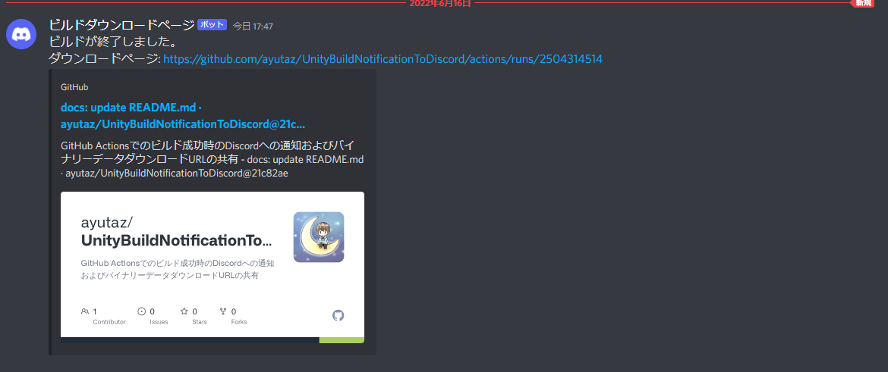

# UnityBuildNotificationToDiscord

GitHub Actionsでのビルド成功時のDiscordへの通知およびバイナリーデータダウンロードURLの共有

# Demo

# requirements

* Unity 2021.3.4f1

# Useage

1. set `github personal token` in Repository settings
2. set 'discord webhook url' in Repository settings
3. Change L13 and L21 in `send-download-artifact-page-url.py` to arbitrary URLs because they are hard-coded